# M5Stack向けMatterサンプル

## 概要

M5Stackを使ったMatterのサンプルコード集です。今のところNanoC6によるThread経由のMatterサンプルに必要なものが置いてあります。

## 構成

### openthread/ot_rcp

ESP-IDFのopenthreadサンプルから持ってきたot_rcpファームウェアです。NanoC6向けにデフォルト設定を調整してあります。

以下のデフォルト設定を変更し、RCPのピンをNanoC6のGROVE互換ポートのピンにしています。

```
CONFIG_OPENTHREAD_UART_PIN_MANUAL=y
CONFIG_OPENTHREAD_UART_RX_PIN=2
CONFIG_OPENTHREAD_UART_TX_PIN=1
```

NanoC6のピン配置は以下の通りです。

| GPIO番号 | 配置箇所        | 方向 | 内容    |
| -------: | --------------- | ---- | ------- |
|        1 | GROVE互換ポート | 出力 | UART TX |
|        2 | GROVE互換ポート | 入力 | UART RX |

#### ビルドと書き込み

```
source esp-idf/export.sh
cd openthread/ot_rcp
idf.py set-target esp32c6
idf.py flash -p /dev/ttyACM0
```

### openthread/ot_br

ESP-IDFのopenthreadサンプルから持ってきたot_brファームウェアです。ot_rcpファームウェアを書き込んだNanoC6と組み合わせてThread Border Routerを構成します。

OT-RCPの接続先をGROVE互換ポートのピンとしています。上記のot_rcpファームウェアでのGROVE互換ポートのピンと対抗するようにTXとRXを入れ替えてあります。

NanoC6のピン配置は以下の通りです。

| GPIO番号 | 配置箇所        | 方向 | 内容    |
| -------: | --------------- | ---- | ------- |
|        1 | GROVE互換ポート | 入力 | UART RX |
|        2 | GROVE互換ポート | 出力 | UART TX |

ot_rcpを書き込んだNanoC6とot_brを書き込んだNanoC6をGROVE互換ポートで互いに接続し、ot_brを書き込んだNanoC6をPCに接続します。



PC上でシリアルターミナルを開き、以下のコマンドを入力して Wi-Fiの接続設定を行います。 `<SSID>` と `<PASS>` をそれぞれ接続先のWi-FiアクセスポイントのSSIDとパスワードで置き換えます。

```
wifi connect -s <SSID> -p <PASS>
```

その後、以下のように表示されWi-Fiアクセスポイントに接続が完了するまで待ちます。

```
wifi sta is connected successfully
Done
```

必要に応じて `dataset` コマンドのサブコマンドをつかって、Threadネットワークのパラメータを設定します。
デフォルトでは以下のパラメータでThreadネットワークを構成します。(元のot_brサンプルのデフォルト値です)

| パラメータ        | 値                                   |
| :---------------- | ------------------------------------ |
| `networkname`     | `OpenThread-ESP`                     |
| `meshlocalprefix` | `fd00:db8:a0:0::/64`                 |
| `channel`         | `15`                                 |
| `panid`           | `0x1234`                             |
| `extendedpanid`   | `0xdead00beef00cafe`                 |
| `networkkey`      | `0x00112233445566778899aabbccddeeff` |
| `pskc`            | `0x104810e2315100afd6bc9215a6bfac53` |


完了後、 `ifconfig up` と `thread start` を実行してThreadの通信処理を開始します。

```
ifconfig up
```

```
I (48483) OPENTHREAD: Platform UDP bound to port 49153
Done
I (48483) OT_STATE: netif up
I (48493) OPENTHREAD: NAT64 ready
> thread start
```

```
thread start
```

```
> thread start

I(51323) OPENTHREAD:[N] Mle-----------: Role disabled -> detached
Done
```

`dataset active -x` を実行して、Threadネットワークに接続するために必要なデータセットの値を取得しておきます。この値はあとでThreadデバイスを接続するために必要なので記録しておきます。

```
dataset active -x
```

```
0e080000000000010000000300000f35060004001fffe0020811111111222222220708fd11002200000000051000112233445566778899aabbccddeeff030e4f70656e54687265616444656d6f010212340410445f2b5ca6f2a93a55ce570a70efeecb0c0402a0f7f8
Done
```


以上でThreadボーダールーターの起動処理は完了です。
